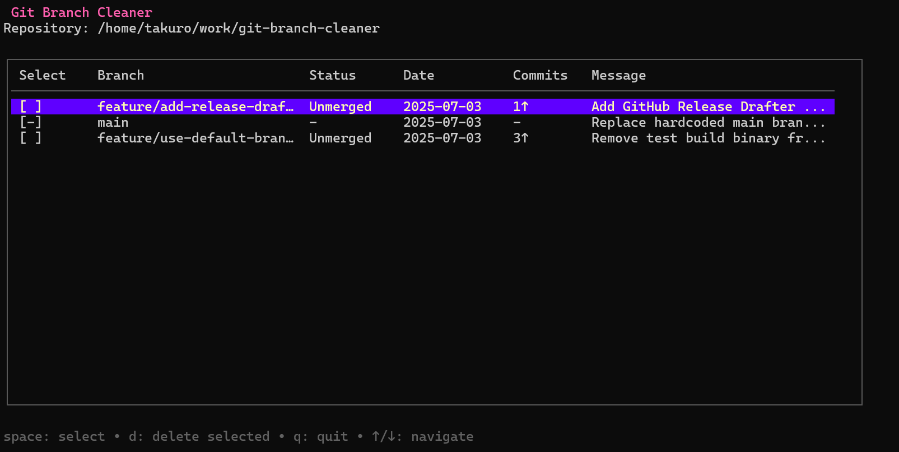

# Git Branch Cleaner

A Terminal User Interface (TUI) tool for efficiently managing and cleaning up local Git branches.



## Features

✨ **Interactive Branch Management**

- View all local branches in a clean table format
- See branch status (merged/unmerged), last commit date, and commit messages
- Display commits ahead of main branch

🔒 **Safe Deletion**

- Protected branches (main/master) cannot be deleted
- Confirmation dialog before deletion
- Warning for unmerged branches

⌨️ **Keyboard Navigation**

- `↑/↓` or `j/k` - Navigate between branches
- `Space` - Select/deselect branches
- `d` - Delete selected branches
- `q` or `Ctrl+C` - Quit application

🎨 **Beautiful Interface**

- Clean terminal UI built with Charm Bracelet libraries
- Color-coded branch status
- Responsive layout

## Installation

### Prerequisites

- Go 1.19 or later
- Git installed and available in PATH

### Build from Source

```bash
git clone https://github.com/takurooo/git-branch-cleaner.git
cd git-branch-cleaner
go build -o git-branch-cleaner
```

### Install Binary

```bash
# Move to a directory in your PATH
sudo mv git-branch-cleaner /usr/local/bin/
```

## Usage

Navigate to any Git repository and run:

```bash
git-branch-cleaner
```

### Branch Information

- **Select**: Checkbox for multi-selection (protected branches show `[-]`)
- **Branch**: Branch name
- **Status**:
  - `Merged` - Branch has been merged into main
  - `Unmerged` - Branch contains commits not in main
  - `-` - Protected branch (main/master)
- **Date**: Last commit date
- **Commits**: Number of commits ahead of main branch
- **Message**: Truncated last commit message

## Example Workflow

1. **Launch the tool** in your Git repository
2. **Navigate** using arrow keys to browse branches
3. **Select branches** to delete using `Space`
4. **Press `d`** to initiate deletion
5. **Confirm** the deletion in the dialog
6. **Continue** managing branches or quit with `q`

## Error Handling

The tool includes comprehensive error handling for:

- Non-Git directories
- Missing Git installation
- Empty repositories (no local branches)
- Git operation failures
- Permission issues

## Technical Details

### Built With

- **[Bubble Tea](https://github.com/charmbracelet/bubbletea)** - TUI framework
- **[Lipgloss](https://github.com/charmbracelet/lipgloss)** - Terminal styling
- **[Bubbles](https://github.com/charmbracelet/bubbles)** - UI components

### Architecture

- `main.go` - TUI application logic and interface
- `git.go` - Git repository operations and branch management
- Clean separation of concerns between UI and Git operations
- Robust error handling and validation

## Requirements

- **Operating System**: Linux, macOS, Windows
- **Go Version**: 1.19+
- **Git**: Any recent version
- **Terminal**: Any terminal with basic color support

## Contributing

Contributions are welcome! Please feel free to submit a Pull Request.

## License

This project is open source and available under the [MIT License](LICENSE).

## Acknowledgments

- Built with the amazing [Charm](https://charm.sh/) ecosystem
- Inspired by the need for better Git branch management workflows
